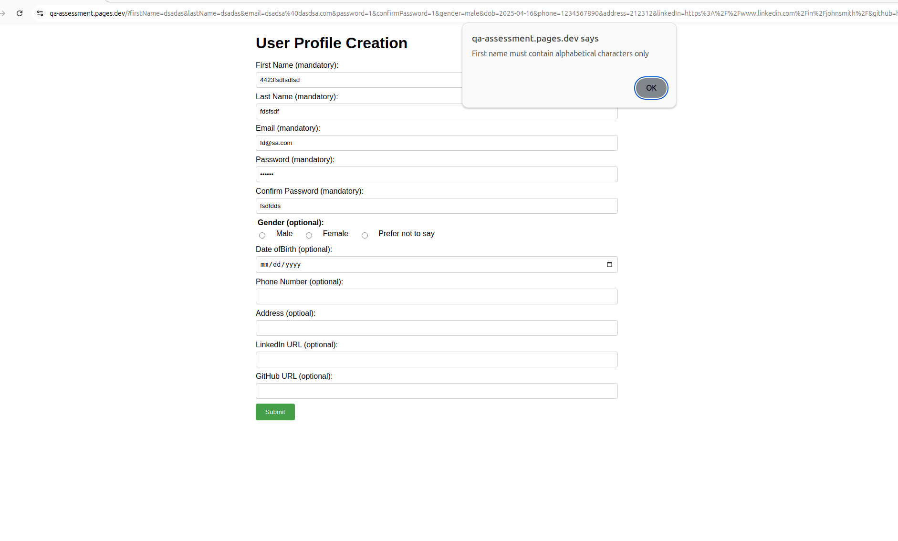
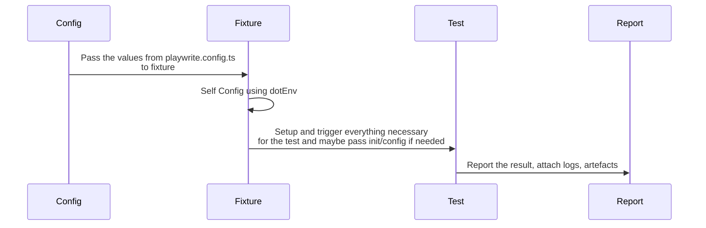
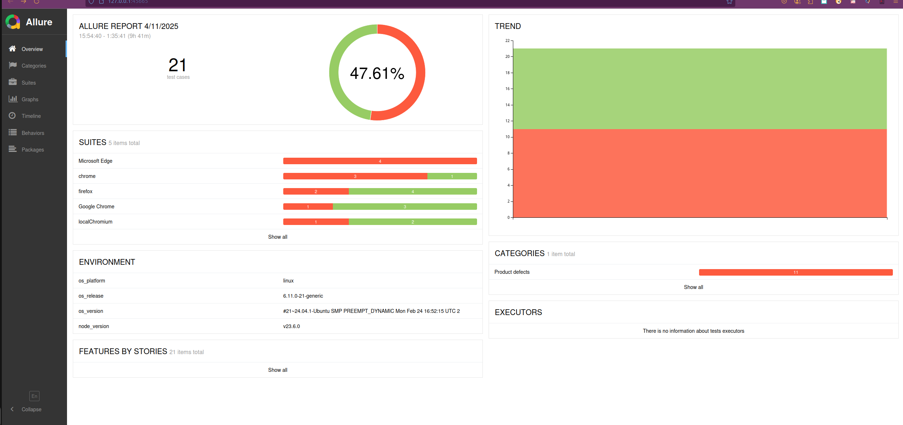

# QA Test Cases for Profile Creation Form

## Test Cases for https://qa-assessment.pages.dev/

### Fully written test

Title: Form can't be submitted without any optional fields filled 

Steps:

| Action                                                        | Expectation                                                                                                                                                                                                                  |
|:--------------------------------------------------------------|:-----------------------------------------------------------------------------------------------------------------------------------------------------------------------------------------------------------------------------|
| Go to https://qa-assessment.pages.dev/                        | User Profile Creation is opened                                                                                                                                                                                              |
| Fill First name field only with alpahbetic chars              | field is filed                                                                                                                                                                                                               |  
| Fill Last name field only with alpahbetic chars               | field is filed                                                                                                                                                                                                               |  
| Fill Email field only with alpahbetic chars                   | field is filed                                                                                                                                                                                                               |  
| Fill Password field only with alphanumeric characters         | field is filed                                                                                                                                                                                                               |  
| Fill Confirm password field only with alphanumeric characters | field is filed                                                                                                                                                                                                               |  
| Note the input data and Click "Submit" button                 | form is submitted                                                                                                                                                                                                            |  
| Verify that the form submitted correct data                  | Urls is changed to <BR>https://qa-assessment.pages.dev/?firstName=z&lastName=z&email=z%40s.com&password=1&confirmPassword=1&dob=&phone=&address=&linkedIn=cds%3A&github= <br> and the noted data corelates to the parameters |  
   
improvement to this approach is to add video in addition to the steps


### Tests planed - for the sake of time cant write them fully as the first on
1. First name (mandatory): happy path: characters, Check can it accept special chars, empty space,  numbers, empty
2. Last name (mandatory): happy path: characters, Check can it accept special chars, empty space, numbers, empty
3. Email (mandatory): happy path valid email addresses - invalid, partial as @some.com, s@mail
4. Password (mandatory): A password field accepting alphanumeric characters and
   symbols (e.g., P@ssw0rd).
5. Confirm password (mandatory): A password field matching the above password field.
   For both password fields : Happy path A password field accepting alphanumeric characters, leave empty, empty space,
   making passwords confirm password matching

6. Gender (optional): Happy path: only one option is selected at a time "male,"
   "female," "non-binary," or "prefer not to say."

7. Date of birth (optional): A date field accepting a valid date in the format of YYYY-MM-
   DD (e.g., 1990-01-01). Check other formats, more info needed for valid dates (why can we select 1881 as year as example)

8. Phone number (optional): Happy path accepting only numerical characters with a
   maximum length of 10 digits, check 10+1 check 10-1, characters, special characters, empty spaces

9. Address (optional): Happy path, accepting alphanumeric characters, spaces, and symbols
   (e.g., 123 Main St, Apt 1). Check can ot be empty, special character

10. LinkedIn URL (optional): A text field accepting a valid LinkedIn profile URL
    (e.g., https://www.linkedin.com/in/johnsmith).
11. GitHub URL (optional): A text field accepting a valid GitHub profile URL
    (e.g., https://github.com/johnsmith).
    For both fields - Happy path valid URL, check partial url s:, https:, https://www., empty field
12. Form - Happy path: submit with only mandatory field, check what data is submitted
13. Form - Happy path: Submit form with mandatory fields + all optional fields, check what data is submitted

Additional tests can be done for SQL and Javascript injections if this site was connected to a db

## Issues Found

1. Form can't be submitted without LinkedIn Url which is marked as option 
2. Confirm password not masked
3. Date of birth can be in the future or too far in the past
4. "Date ofBirth" - should be "Date of Birth"
5. LinkedIn Url can be s:
6. GitHub Url can be s:


### Bug Report
Title: Form can't be submitted without LinkedIn Url which is marked as option
Severity: Critical
Description: Form Can't be submitted only with the mandatory parameters
Steps to reproduce:
1. Go to https://qa-assessment.pages.dev/
2. Fill all mandatory fields
3. Submit the form
4. Verify form submission

_Actual Result:_ Form is not submitted and alert dialog is displayed


_Expected Result:_ Form can be submitted and user profile create


## Install
Install Node 23.6 or newer

Run
```shell
  npm install
```

Install Playwright browsers
```shell
  npm playwright install
```

Install Playwright operating system dependencies requires sudo / root
```shell
  sudo npm playwright install-deps
```

[More info on running tests](https://playwright.dev/docs/running-tests)

for additional report  install
```shell
  npm install allure-commandline
```
## Extra tooling

Auto-generate tests with Codegen.

```shell
  npm playwright codegen
```

Starts the interactive UI mode. This also can be set in the config.

```shell
  npm playwright test --ui
```


Allure report display needs JAVA_HOME set  
and to run the server, JDK version 8 to 11 is required. Otherwise, you get:
``` 
Starting web server...
Exception in thread "main" java.lang.UnsatisfiedLinkError: Can't load library: /usr/lib/jvm/java-17-openjdk-amd64/lib/libawt_xawt.so
at java.base/java.lang.ClassLoader.loadLibrary(ClassLoader.java:2398)
at java.base/java.lang.Runtime.load0(Runtime.java:755)
at java.base/java.lang.System.load(System.java:1970)
at java.base/jdk.internal.loader.NativeLibraries.load(Native Method) 
```

_**However, running the report from a server or IDE also works, so it is up to you.**_

## Writing test
Currently, the flow once the run starts is: provide some configuration based on `playwright.config.ts` [test project](https://playwright.dev/docs/test-projects)  
(project can be viewed as a way to parametrize the tests) to the [fixture](https://playwright.dev/docs/next/test-fixtures#introduction) of the test located in the [fixtures folder](./fixtures).  
In the folder, there is a base fixture to start the browser that is required. Depending on the required steps, you can do actions even before and after hooks in the tests.  
A good example is running services, browsers, etc. From the fixture, you can pass down test configuration or any other data required.  
Once in the test, the run follows any regular unit testing framework flow.

Note: to see the diagram you need mermaid plugin install for your IDE

Some more useful links for Playwright:  
https://playwright.dev/docs/locators#quick-guide
https://playwright.dev/docs/api/class-electronapplication#electron-application-evaluate

## Running test
Runs the end-to-end tests (all projects):

``` shell
  npm playwright test
```

Runs the tests only on Desktop Chrome.

```shell
  npm run test:chromium
```

To run Electron tests:

```shell
  npm run test:electron
```


Runs the tests in framework debug mode.

```
npm playwright test --project=chrome  --debug
```

Runs the tests in a specific file:

```shell
  npm run playwright test example
```

## Debug

Add `DEBUG=pw:api` as an environment variable. 

## Reports

Running:

```shell
  npm run test:chromium
```

will generate HTML and Allure reports. However, those reports are for a single run. In order to have history, which is more useful, run:

```shell
npm run test:chrome:allureHistoryReport
```
You can find the report in [allure-report](./allure-report) folder. However, in order to get it displayed you either need to run from
already running local web server form your IDE (Webstorm this will be Right Click on alure-report/index.htm, from the context menu choose
Open In > Browesr and pick your browser). For VS Code depends on your setup.
Or run

```shell
npm run generateAndShowReports
```

To display te report. Note that this is dependat on the java installed on you machine, see above
Change it depending on your needs to enable history for the report that can show you around 20 executions. Additional info can be  
added to this report. For more information, see: https://allurereport.org/docs/playwright-reference/


## Improvements

